# Candidate Chess ♟️

A chess training app built around the Kotov method — find the engine's top
moves Family Feud style. No hints, no eval bar, 3 strikes.

**Live:** [candidatechess.com](https://candidatechess.com)


---

## What it does

- **Daily challenge** — one shared position per day, streak tracking
- **Random mode** — draw from a curated pool of middlegame positions
- **Custom Mode** — paste any FEN and play the game from there
- **Study mode** — paste any FEN, add candidate moves, get move quality
  scores.
- **Library Mode** — View and filter the playbale positions.

Move quality is calculated via win% delta using a logistic
function on Stockfish centipawn evaluations — same methodology used by
Lichess and Chess.com.

---

## Architecture



### Frontend

React 19 + TypeScript, built with Vite. Stockfish 18 runs entirely
client-side as a WASM Web Worker — no server-side engine calls.

The engine layer uses a pool/coordinator pattern: two engine instances
(active + standby) rotate on position advance. While the user plays, the
standby instance pre-analyzes the next position. On advance, the active
instance is terminated, standby becomes active, and a fresh standby spawns.

PV-first design: positions ship with pre-computed principal variations.
Live Stockfish analysis only runs when PVs are absent.

### Backend

Cloudflare Worker (Hono) handles `/api/*` routes. Static assets serve
directly from Cloudflare's CDN. D1 (SQLite via Drizzle) stores user
accounts, solve history, and sessions. Auth via Google + Lichess OAuth
(arctic), HTTP-only session cookies, 30-day expiry, weekly cron cleanup.
Bot protection via Cloudflare Turnstile.

### Position data pipeline (offline)

Positions are pre-computed offline from the
[Lichess Elite Database](https://database.nikonoel.fr) and shipped as
static JSON. The pipeline is idempotent — each stage skips already-
processed positions.

1. extract.py — stream PGN, sample positions, Stockfish depth 10 via Celery workers, coarse filter, save to SQLite
2. enrich.py — local processing: phase, category, complexity tags, balance, piece features, fine filter
3. eval.py — deep re-eval at depth 20 / MultiPV 20 via Celery workers
4. tactics.py — tactic theme tagging via lichess-cook

Celery + Redis workers run inside Docker. Pipeline scripts run locally;
workers can distribute across LAN machines for parallelism.

Output: `positions.db` → exported to 16 zobrist-sharded JSON chunk files
(`public/positions/chunks/0.json` … `f.json`). All 16 chunks preload on
app mount for instant filtering.

See [`position_generation/readme.md`](position_generation/readme.md) for
full pipeline docs.

---

## Tech stack

| Layer       | Technology                        |
| ----------- | --------------------------------- |
| Framework   | React 19 + TypeScript             |
| Build       | Vite                              |
| Styling     | Tailwind CSS v4                   |
| Chess logic | chess.js + Chessground            |
| Engine      | Stockfish 18 (WASM, client-side)  |
| Backend     | Cloudflare Workers + Hono         |
| Database    | Cloudflare D1 (SQLite) + Drizzle  |
| Auth        | Google + Lichess OAuth via arctic |
| Pipeline    | Python + Celery + Redis + Docker  |
| Data source | Lichess Elite Database            |

---

## Local development

```bash
npm install
npm run dev        # Vite dev server
npm run build      # Production build → dist/
npm run test       # Vitest
npm run lint       # ESLint
```

Stockfish WASM (`public/stockfish.js`) is committed directly — no CDN
dependency.

For the position pipeline, see `position_generation/readme.md`.
