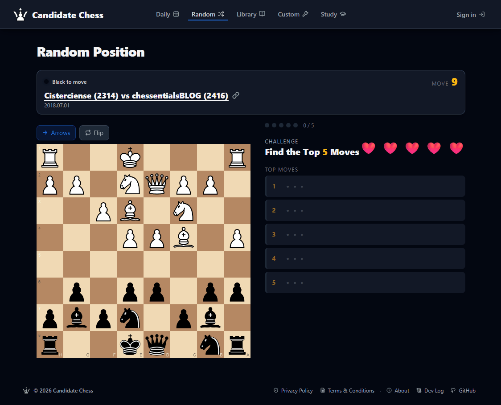

**Candidate Chess ♟️**

A chess training app built around one question: _what do I do here?_

You're shown a position and asked to find the engine's top 5 moves — Family Feud style. No eval bar, no hints, 3 strikes. Loosely inspired by the Kotov method. Built to train middlegame intuition through deliberate candidate move thinking.

→ **Live app: [CandidateChess.com](candidatechess.com)**



---

**How it works**

- You're shown a middlegame position from high-level games
- Drag moves onto the board to submit candidates
- Game ends when you find all top moves or exhaust your strikes

## Modes

| Mode   | Description                                        |
| ------ | -------------------------------------------------- |
| Daily  | A shared position for everyone, refreshed daily    |
| Random | A random position from the precomputed set         |
| Custom | Upload your own position via FEN or PGN            |
| Study  | Analysis board — engine evals hidden until you ask |

---

## Getting Started

```bash
npm install
npm run dev
```

> Stockfish 18 WASM is committed directly to the repo so no additional setup is needed. If you want to update Stockfish, you'll need to manually move the new package files into place — see [ARCHITECTURE.md](./ARCHITECTURE.md) for details.

## Architecture

See [ARCHITECTURE.md](./ARCHITECTURE.md) for a breakdown of app structure, Stockfish integration, and how the daily puzzle works.
